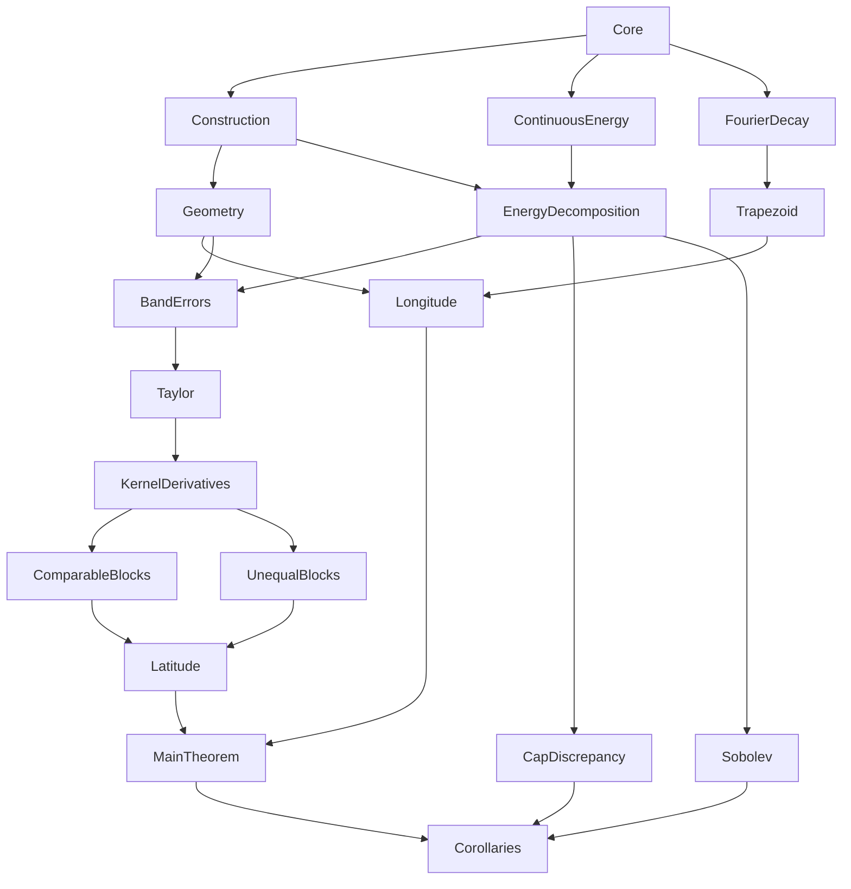

# Blueprint for definitive.tex

This blueprint covers the main Riesz energy theorem, both displayed
corollaries, and their optimality ingredients. Each module guide explains its
proof, names the dependencies, and embeds the exact Lean source. A proposition
definition records work to be done; only a theorem with a checked proof body
is a completed result. See [the inventory](../LEAN_FORMALIZATION.md).

The main theorem applies to every N≥4 and every choice of ring phases, with
one positive constant for each fixed 0<α<2. The appendices estimate the new
midpoint-only construction, not the earlier Simpson construction.

| Module and full proof guide | Main responsibility | Mathematical inputs |
|---|---|---|
| [Core](modules/Core.md) | Sphere, measure, kernel, energy | Euclidean geometry, rpow, geometric surface measure |
| [Construction](modules/Construction.md) | Actual Diamond points, counts, injectivity | Core; natural square root, finite arithmetic, trigonometric periods |
| [Geometry](modules/Geometry.md) | Radius and angular band estimates | Construction identities, arccos estimates |
| [ContinuousEnergy](modules/ContinuousEnergy.md) | Surface disintegration, constant potential, negative type | Core; polar measure, Schoenberg representation |
| [EnergyDecomposition](modules/EnergyDecomposition.md) | Deficit=A+B; nonnegative deficit bridge | Construction, ContinuousEnergy |
| [FourierDecay](modules/FourierDecay.md) | Cusp coefficients and uniform parameter bound | Beta/Gamma, Fourier integration, dominated convergence |
| [Trapezoid](modules/Trapezoid.md) | Shifted angular rule and gcd/lcm grid | FourierDecay, uniform Fourier inversion, finite group fibers |
| [Longitude](modules/Longitude.md) | Full angular error bound | Trapezoid, Geometry, gcd sum/p-series |
| [BandErrors](modules/BandErrors.md) | Band functional, moments, exact tensor decomposition | Geometry, EnergyDecomposition, finite Fubini/partition |
| [Taylor](modules/Taylor.md) | Double two-moment cancellation | BandErrors, C⁴ local extension, Taylor remainder |
| [KernelDerivatives](modules/KernelDerivatives.md) | Polar and separated derivative bounds | Taylor API, chain rule, even binomial series |
| [ComparableBlocks](modules/ComparableBlocks.md) | Polar/diagonal/adjacent/separated comparable cases | Geometry, Taylor, KernelDerivatives, cusp splitting |
| [UnequalBlocks](modules/UnequalBlocks.md) | Same-side and opposite/central unequal scales | Geometry, Taylor, separated series extension |
| [Latitude](modules/Latitude.md) | Sum all regimes; phase-uniform small sizes | Band identity, symmetry, three block estimates, power sums |
| [MainTheorem](modules/MainTheorem.md) | Assemble the energy theorem | LatitudeBound, LongitudeBound, SmallSizeBound, DiamondNonnegative |
| [CapDiscrepancy](modules/CapDiscrepancy.md) | Actual cap observable, Stolarsky, Beck | Surface geometry, indicator integration, universal lower bound |
| [Sobolev](modules/Sobolev.md) | Actual harmonic spectral unit ball and WCE | Harmonic basis, embedding, distance-kernel comparison, universal lower bound |
| [Corollaries](modules/Corollaries.md) | Exponent conversion and both final results | MainTheorem, CapDiscrepancy, Sobolev |

The Lean import graph is a DAG of definitions. The mathematical proof graph
is stronger: for example `LongitudeBound α` will be *proved using*
`TrapezoidBound α`, `GcdSumBound α`, geometry and construction. Importing those
proposition definitions does not supply their proofs. The guide for every
module distinguishes these two kinds of dependency.

Recommended proof order: construction/counting and generic surface facts;
then independent longitude and latitude branches; then the energy theorem;
then Stolarsky/Beck and spectral Sobolev theory; finally comparator validation
of the exact exported statements. The existing conditional assembly lets the
analytic branches meet without hiding assumptions.

Open source issues are collected in [NOTEBOOK.md](../NOTEBOOK.md). The
independent [Sol reviews](../reviews/README.md) cover all 18 modules. Run
`python scripts/sync_blueprint.py` whenever Lean source changes; the check
mode rejects stale embedded statements.
